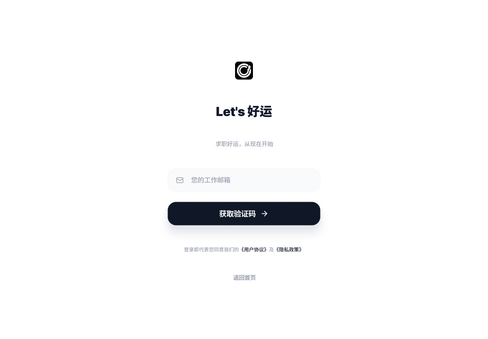
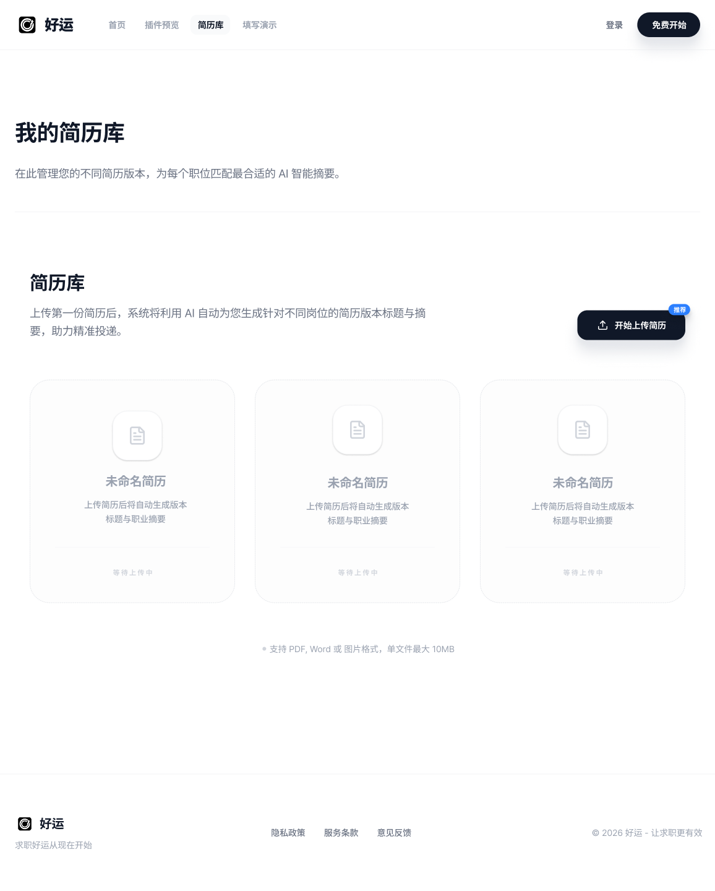
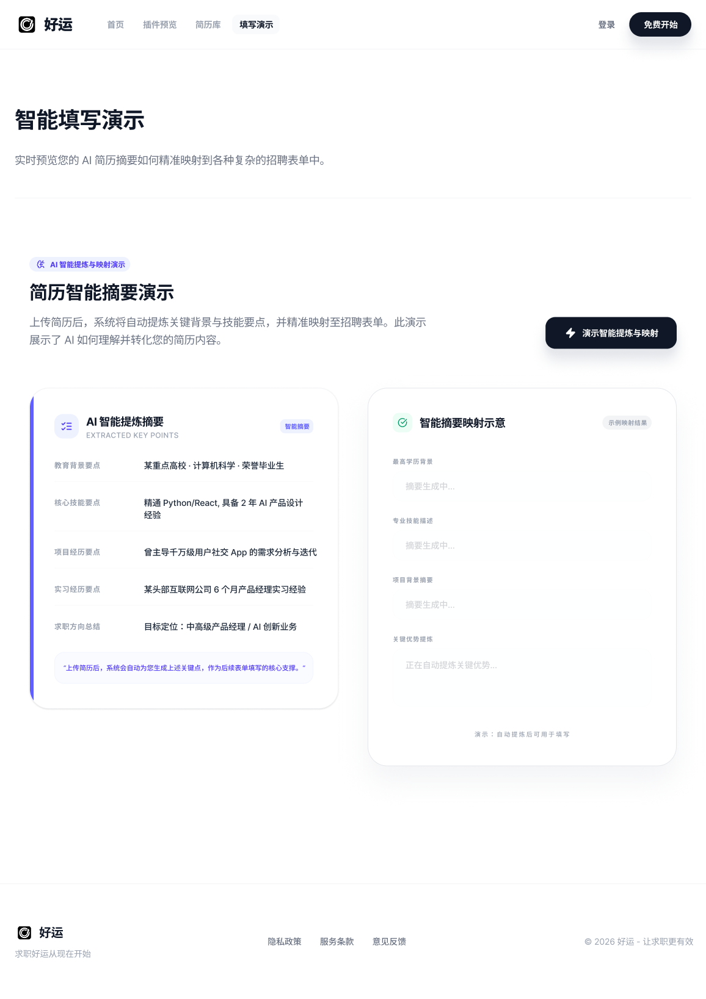
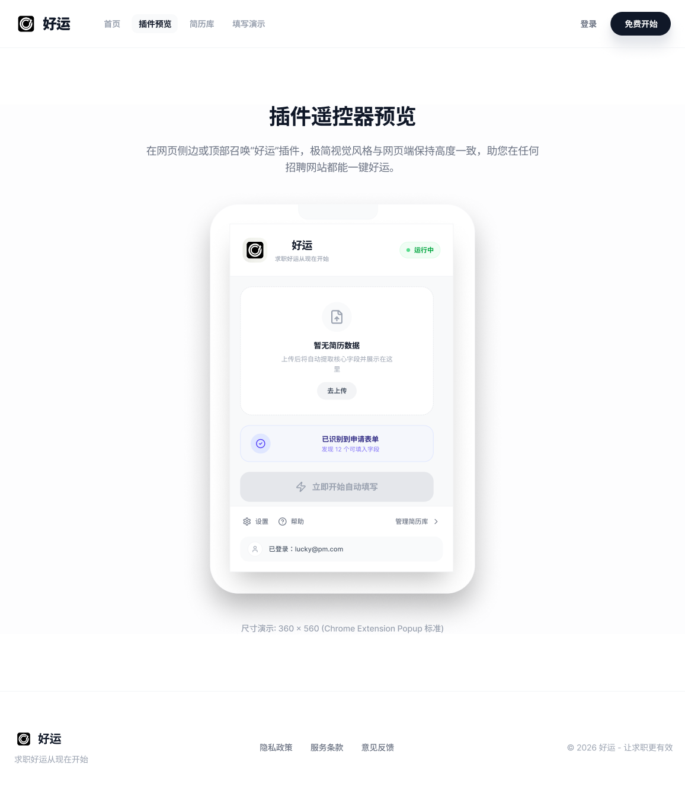

# 好运 AI（Haoyun AI）—— AI 驱动简历管理与自动填表平台
AI-Powered Resume Management & Auto-Fill Platform
🔗 Product Prototype / 产品原型演示：[https://easel-cameo-93798642.figma.site](https://haoyun.figma.site/)

> ⚠️ This is a UI prototype built with Figma Make, demonstrating the product vision,
> user flow, and interface design. The actual AI autofill functionality is implemented
> in the haoyun-extension repository.
>
> 注：此为 Figma Make 制作的 UI 交互原型，展示产品设计思路与用户流程。
> 实际 AI 自动填写功能见 haoyun-extension 仓库。
---

**Product Screenshots 产品截图**

**主页 / Main Page**

**登录页 / Login**

**简历库 / Resume Library**

**自动填写演示 / Auto-Fill Demo**

**插件视图 / Extension View**

---

**Product Value 产品价值**

- 帮助求职者集中管理简历，避免在不同平台重复填写
- 通过 LLM 字段智能匹配，自动识别表单字段并填入对应信息
- 支持中英文简历场景，适配 LinkedIn / 智联招聘 / BOSS 直聘等主流平台

- Centralized resume management to eliminate repetitive form-filling
- LLM-based intelligent field matching for automatic form detection and autofill
- Bilingual (CN/EN) support for major job platforms

---

**Tech Stack 技术栈**

React · TypeScript · Vite · OpenAI API · LLM · Prompt Engineering · Figma (UI Design) · Vibe Coding (Codex)

---

**Product Structure 产品结构**

- `haoyun-app`（本仓库）= 前端管理平台 / Frontend management platform
- `haoyun-extension` = Chrome 插件端 / Chrome extension for autofill
- 两者配合构成完整 AI 求职辅助产品闭环

---

**My Role 我的角色**

独立完成产品定义、UI 设计（Figma）与前端开发全流程  
Independently completed product definition, UI design (Figma), and full front-end development

- 产品需求定义与用户流程设计
- Figma UI 设计与前端实现（React + TypeScript）
- LLM API 集成与 Prompt Engineering
- 基于 Vibe Coding（Codex）快速迭代

---

**Related Repository 相关仓库**

Chrome Extension: https://github.com/zoezhuy/haoyun-extension

---

**Contact 联系方式**

Email: zz3378@tc.columbia.edu  
GitHub: https://github.com/zoezhuy
